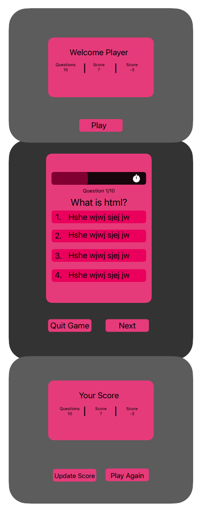
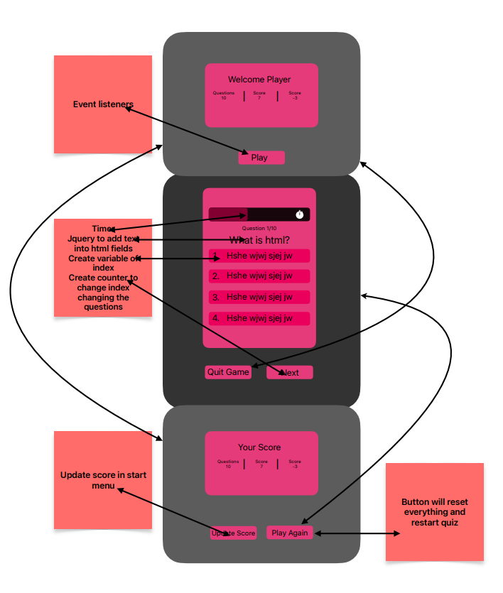

# Quiz

## Description

Provide a short description explaining the what, why, and how of your project. Use the following questions as a guide:

- What was your motivation? My motivation for this project was to learn how to use all the material together. Here I implented event listeners using jquery. I also used a a little of of dom traversal to add the the game over text and question number.
- Why did you build this project? I built this project because I want to become a better developer by practicing these concepts together.
- What problem does it solve? This app allows users to test their knowledge. It can be used to study.
- What did you learn? I learned how to manipulate html through javascript, use innertext, and how to use event listeners.
 - Things I wish I could have completed? I wasn't able to add local storage to my application. That would of made my application completed and better for the user. 

   ## Mockup
    
    ## Features Needed
    
   

## License

## Badges

